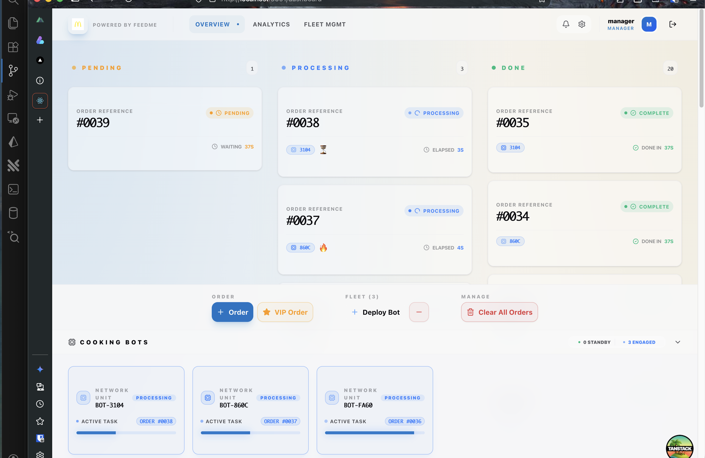

## FeedMe Software Engineer Take Home Assignment
Below is a take home assignment before the interview of the position. You are required to
1. Understand the situation and use case. You may contact the interviewer for further clarification.
2. implement the requirement with **either frontend or backend components**.
3. Complete the requirement with **AI** if possible, but perform your own testing.
4. Provide documentation for the any part that you think is needed.
5. Bring the source code and functioning prototype to the interview session.

### Situation
McDonald is transforming their business during COVID-19. They wish to build the automated cooking bots to reduce workforce and increase their efficiency. As one of the software engineer in the project. You task is to create an order controller which handle the order control flow. 

### User Story
As below is part of the user story:
1. As McDonald's normal customer, after I submitted my order, I wish to see my order flow into "PENDING" area. After the cooking bot process my order, I want to see it flow into to "COMPLETE" area.
2. As McDonald's VIP member, after I submitted my order, I want my order being process first before all order by normal customer.  However if there's existing order from VIP member, my order should queue behind his/her order.
3. As McDonald's manager, I want to increase or decrease number of cooking bot available in my restaurant. When I increase a bot, it should immediately process any pending order. When I decrease a bot, the processing order should remain un-process.
4. As McDonald bot, it can only pickup and process 1 order at a time, each order required 10 seconds to complete process.

### Requirements
1. When "New Normal Order" clicked, a new order should show up "PENDING" Area.
2. When "New VIP Order" clicked, a new order should show up in "PENDING" Area. It should place in-front of all existing "Normal" order but behind of all existing "VIP" order.
3. The order number should be unique and increasing.
4. When "+ Bot" clicked, a bot should be created and start processing the order inside "PENDING" area. after 10 seconds picking up the order, the order should move to "COMPLETE" area. Then the bot should start processing another order if there is any left in "PENDING" area.
5. If there is no more order in the "PENDING" area, the bot should become IDLE until a new order come in.
6. When "- Bot" clicked, the newest bot should be destroyed. If the bot is processing an order, it should also stop the process. The order now back to "PENDING" and ready to process by other bot.
7. No data persistance is needed for this prototype, you may perform all the process inside memory.

### Functioning Prototype
You must implement **either** frontend or backend components as described below:

#### 1. Frontend
- You are free to use **any framework and programming language** of your choice
- The UI application must be compiled, deployed and hosted on any publicly accessible web platform
- Must provide a user interface that demonstrates all the requirements listed above
- Should allow users to interact with the McDonald's order management system

#### 2. Backend
- You must use **either Go (Golang) or Node.js** for the backend implementation
- The backend must be a CLI application that can be executed in GitHub Actions
- Must implement the following scripts in the `script` directory:
  - `test.sh`: Contains unit test execution steps
  - `build.sh`: Contains compilation steps for the CLI application
  - `run.sh`: Contains execution steps that run the CLI application
- The CLI application result must be printed to `result.txt`
- The `result.txt` output must include timestamps in `HH:MM:SS` format to track order completion times
- Must follow **GitHub Flow**: Create a Pull Request with your changes to this repository
- Ensure all GitHub Action checks pass successfully

#### Submission Requirements
- Fork this repository and implement your solution with either frontend or backend
- **Frontend option**: Deploy to a publicly accessible URL using any technology stack
- **Backend option**: Must be implemented in Go or Node.js and work within the GitHub Actions environment
  - Follow GitHub Flow process with Pull Request submission
  - All tests in `test.sh` must pass
  - The `result.txt` file must contain meaningful output from your CLI application
  - All output must include timestamps in `HH:MM:SS` format to track order completion times
  - Submit a Pull Request and ensure the `go-verify-result` workflow passes
- Provide documentation for any part that you think is needed

### Tips on completing this task
- Testing, testing and testing. Make sure the prototype is functioning and meeting all the requirements.
- Treat this assignment as a vibe coding, don't over engineer it. Try to scope your working hour within 30 min. However, ensure you read and understand what your code doing.
- Complete the implementation as clean as possible, clean code is a strong plus point, do not bring in all the fancy tech stuff.

## Submission Notes
- Implementation choice: **Frontend** (TanStack Start + React + TypeScript)
- Public URL: **https://pos-m391mv8bx-james-tans-projects-cd0a4434.vercel.app**

## Getting Started

### Prerequisites
- Node.js 20+
- pnpm (or bun)

### Quick Start (from project root)

**Option 1: Using Make**
```bash
make dev
# Opens http://localhost:3000
```

**Option 2: Using pnpm (workspace)**
```bash
# Install all dependencies
pnpm install

# Run development server
pnpm dev
# Opens http://localhost:3000
```

**Option 3: Using bun**
```bash
cd pos && bun run dev
```

### Local Setup (from pos directory)
```bash
cd pos
pnpm install

# For local development with SQLite (optional)
pnpm add better-sqlite3 --save-optional

# Run development server
pnpm dev

# Open http://localhost:3000
```

### Demo Accounts
| Username | Password | Role |
|----------|----------|------|
| normal_user | password123 | NORMAL |
| vip_user | password123 | VIP |
| manager | password123 | MANAGER |

## Test Checklist/Results
All requirements have been verified and tested. See `TEST.md` for detailed test results.



### Key Requirements Verified
- [x] Normal orders appear in PENDING area
- [x] VIP orders queue before all Normal orders
- [x] VIP orders queue behind existing VIP orders
- [x] Order numbers are unique and increasing
- [x] Bots process orders (10-second timer)
- [x] Bots become IDLE when no orders pending
- [x] Bot removal returns in-flight order to PENDING
- [x] UI displays PENDING/PROCESSING/COMPLETE columns correctly

### Technical Stack
- **Framework**: TanStack Start (React SSR with file-based routing)
- **UI Library**: shadcn/ui components with Tailwind CSS v4
- **Database**: Drizzle ORM with Turso (LibSQL) for production
- **State Management**: TanStack Store for client state, TanStack Query for server state
- **PWA**: Progressive Web App with offline support (IndexedDB via Dexie.js)
- **Deployment**: Vercel

### Architecture Highlights
- **UUID7** for all primary keys (time-ordered, conflict-resistant)
- **Soft Delete** with `deleted_at` timestamp
- **Foreign Key Cascades**: User delete preserves orders, Bot delete unassigns orders
- **Backend Bot Processing**: Order completion scheduled via Upstash QStash (10s delay)
- **Processing Resume**: On startup requests, in-flight orders are resumed and completed/scheduled as needed
- **Distributed Locking**: Database-level locks (resume_locks table) prevent concurrent recovery operations on single instance

### Scaling Limitations

**⚠️ Horizontal Scaling Not Supported**

This implementation is designed for **single-instance deployment** and does not support horizontal scaling with multiple server instances. Here's why:

**Distributed Lock Mechanism:**
- The `resumeProcessingOrders()` recovery function uses a simple database lock (resume_locks table) with TTL
- This lock works only for preventing concurrent operations within a single instance
- With multiple instances, different servers would simultaneously acquire the lock and run duplicate recovery operations

**What Would Be Needed for Horizontal Scaling:**
1. **Redis or similar** distributed cache for cross-instance locking (SET NX with TTL)
2. **Shared message queue** (RabbitMQ, AWS SQS, etc.) for order distribution instead of polling
3. **Consensus mechanism** for bot assignment across instances (e.g., lease-based leader election)
4. **Distributed tracing** to ensure exactly-once processing guarantees

**Current Bottlenecks:**
- All servers poll `GET /api/orders` every 2 seconds (thundering herd on scale)
- Resume lock only prevents redundant work on same instance
- Bot assignment via atomic transactions works per-instance only
- No way to coordinate which instance claims which order across cluster

**Single Instance Guarantees:**
- ✅ No duplicate order processing
- ✅ No race conditions in bot assignment
- ✅ Automatic recovery from crashes
- ✅ Consistent state across all operations

For production multi-instance deployments, recommend implementing a proper job queue system (Bull, Temporal, or similar).

### System Documentation
- **[ORDERS_BOT_QUEUE.md](./ORDERS_BOT_QUEUE.md)**: Comprehensive explanation of the orders → bot queue system, including data structures, assignment flow, recovery logic, stuck bot conditions, client-side state management, and the complete order lifecycle with failure scenarios.

### Environment
- `APP_BASE_URL` is required so QStash can call back into `/api/orders/complete` (use a public URL in dev, e.g. via ngrok).
- **Offline-First**: Local IndexedDB storage with sync queue for when online
